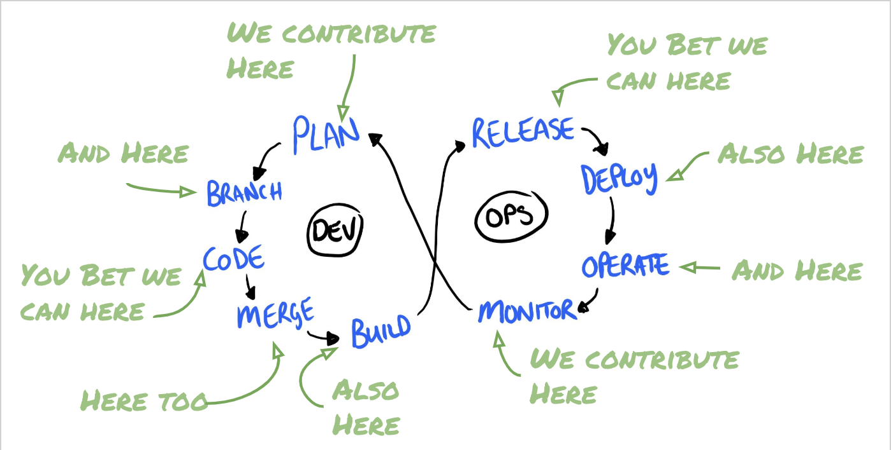
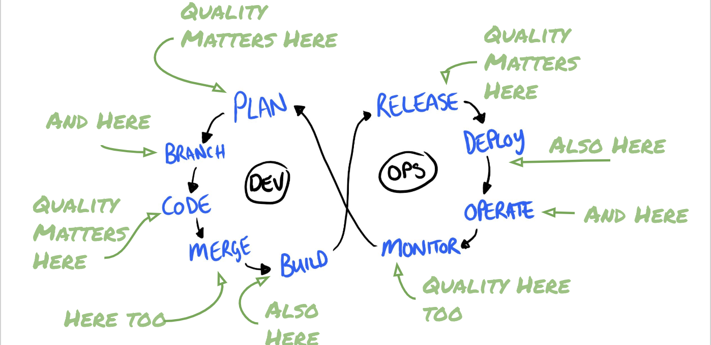

In a keynote at [Agile Testing Days USA 2019](https://agiletestingdays.us/session/quality-then-quality-now/), [Jamet Gregory](http://www.janetgregory.ca/) and her daughter [Susan Bligh](https://twitter.com/@sbligh) shared a great diagram created by [Dan Ashby](https://danashby.co.uk/2016/10/19/continuous-testing-in-devops/). It highlights that while testing is something that is often not explicitly talked about in DevOps, it is present at every stage in the process. 

As I reflected on this and as someone that works and speaks about testing in Devops, what I continue to find is testers refer to themselves as *testing* things when what they are really doing is using a broad range of skills to impact quality throughout the development cycle.  

It's definitely true that there are things that can be tested throughout the DevOps cycle. Not all places in that cycle have active or reoccurring testing. 

There is a difference between testing monitoring and ensuring we have quality metrics being captured. There is a difference between testing a design and helping to shape a better design. There is a differnece between a tester helping shape, groom and offering insight in the planning process with testing the planning process. 

What often happens is we label things with `test` that really aren't testing activities, instead it acts as a proxy to indicate or announce that yes, a tester can contribute here and will likely make things better.

## Test Ambiguity 

One of the primary contributions a tester brings to a team is diversity of perspective. Testers are outside of the creators bubble developers often find themselves in and outside of the feature focus many product team members have. 

Testers by nature question assumptions and are often the first consumers of applications and features and tasked with modeling and understanding the drivers, motivations and behavior of users. It's like being a dedicated [focus group](https://en.wikipedia.org/wiki/Focus_group) for your team. 

This set of skills gets misattributed to the testers mindset. Testers and their associated mindset is fueled by a passion for quality and a yearning to understand. 

It's not about finding bugs or new and interesting ways breaking things. The primary motivation isn't the tests or testing. Testing simply acts as a medium for learning, a gateway for building undserstanding. As we explore we deepen our understanding of the application, its behavior, architecture, limitations. This understanding is the foundation we build tests around.

The problem is we often conflate applying this understanding and motivation with testing. Being a tester doesn't mean everything you do is testing, or even worse QA-ing. The more this line of thinking is encouraged, the easier it becomes to marginalize the contributions and skills testers possess. *Own Your Skills*

## Implied Ownership

It's pretty common for other roles on your team to not fully understand what a tester does. Testers are often [pigeonholed](https://en.wikipedia.org/wiki/Pigeonholing) on their teams.  Since there isn't a deep understanding of the testers role, when people see the word **test** they often mentally map that action onto a role. Test tasks are the realm of the testers and QA people. 

By saying we can test here, we are saying our skills apply here, we are interested in knowing more about this,  include us. This false labelling contributes to misunderstanding testers and inhibits access to areas where our experience identifying risk, understanding our customers and deep product knowledge can contribute to quality outcomes. 

## Quality Evangelism

As we reduce our dependance on **test** as a requirement for our contributions we open ourselves to greater impact. 

We have to [let go of testing](https://www.techwell.com/techwell-insights/2019/06/how-devops-has-changed-landscape-testing) and [open source our mindset](https://testingindevops.org/open-sourcing-your-mindset-by-brendan-connolly/) fostering a culture of quality, rather than say testing is everywhere. 

Quality matters at each point in the devlopment cycle, so testers need to be included and can step into a leadership role because quality has been our primary focus.  

There's no more statements like *We aren't ready for testing yet* because we arent testing, we are instead actively evangelizing quality to our team throughout the DevOps cycle. Mentoring, and drawing attention to potential quality risks by asking questions like: 

> How are WE Assuring Quality here?

> Does our Test Strategy enable the quality our customers expect?

> Is our pace a quality risk?

> Are we measuring quality here?

