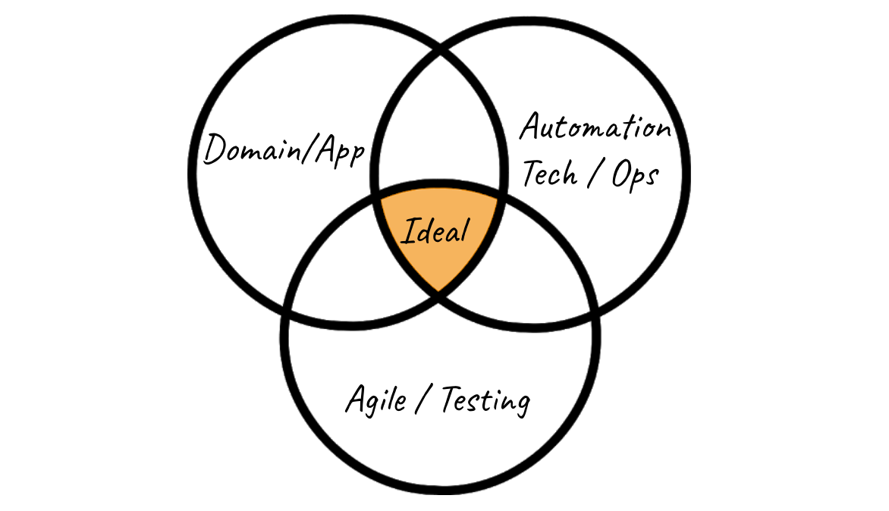

# Quality As A Service
## Building Contribution Guidelines for Meaningful QA  

### Unicorns of Testing

The ideal tester is mixes:

If you start to consider different levels in along a career journey, the number of peole that can fit into this `ideal` shrinks dramatically.

It's unrealistic to expect to find or even develop people into this ideal zone. The truth is a QA teams population is a broad spectrum of skills and interests across those zones. 

This diversity of perspective, skill and background is a strength. Enabling that strength to more readily contribute to their individual teams will allow QA to have a much larger impact on their teams and on the product as a whole.

## Context Matters
It's comforting to know the answer when someone asks for your advice. The ability to give advice relies heavily on how well you understand the situation and the people involved. The more shallow that understanding the more shallow and less impactful the advice is. 

Shallow advice is often hurtful to communication. A standard response to a common problem closes the door to conversation, it presupposes that the person asking is either unaware of conventional practice, or unable to contribute in that fashion. People feel like they are not being heard or understood, that they are lacking rather than the scenario challenging or unique.

Peoples skills and skill levels shape the way that they contribute to teams. People need to understand how a commonly accepted `best practice` fits into their context, given their skills, their team, their circumstance.

To do this I suggest:

### QA Persona Mapping

Think about QA in terms of specializations, consider the set of services a QA person can provide a team. I broke this into 2 personas. 

 #### Quality Owner
 - Agile / Testing Expertise
 - Domain / Application / Procore Expertise

 #### Quality OPS
 - Technical Expertise
 - Automation Expertise
 - Infrastructure Expertise

Armed with a deeper understanding of personas apply those models into common scenarios a QA person will find themselves in.

### Squad/Team Scenario Mapping
Agile-centric Scenarios
- Grooming
- Retro
- Sprint Planning
- Test Strategy

Developer-centric Scenarios
- Code Review
- Pair Coding
- Mob Coding

QA/Test Scenarios
- Exploratory Testing
- Regression Testing
- Pair/Mob Testing

## In Practice

### Set the Scene
With that bit of scaffolding we can have create scenarios to model `ideal` or `positive` contributions from QA.

Define the Character
Define the Environment/Situation/ Team Dynamics

Given those inputs describe potential positive QA contributions in that context.

## Continuously Supporting Quality 
These models and discussions aren't meant to be static. Instead they should be continously evolving and updating exactly the way we iteratively build an application. 

Provide avenue for cross pollination of ideas - bringing QA together to discuss, comiserate and share
Workshop -  bring people to discuss their personal experience and refine/update our ideals
Phone-A-Friend Resources - have experienced folks to help people/teams based on their specialized skills.

This type of material helps individuals directly at their level while also serving as a framing for larger conversations around career growth and advancement.

Provide individual QA team members with tangible and contextual tools and resources to empower them to make informed decisions alongside their teams.

So our `ideal` becomes the intersection of 
- `Knowledge` A solid foundation of understanding for their craft
- `Community` An organization that collaborates, educates and evolves to support our testers
- `Autonomy` The power to make decisions about quality in practice tailored to their teams.

Automation 
Autonomous at the edge
Conservative in the middle

Give people freedom to explore and find solutions to suite their needs and teams needs, 
Be slow to apply these edge solutions until adoption is proven warranted. Especially for cross cutting concerns.

Sharing, collaboration, and buy-in is paramount before central adoption

