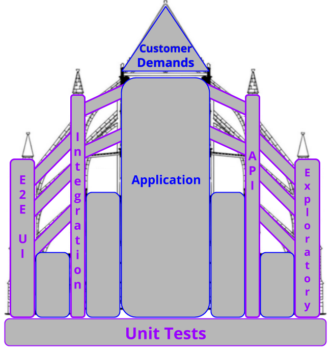

It's been a bit, a lot has gone on in the world since my last update. I hope this finds you all safe and healthy. 

It has been a challenge to focus, but progress is still happening. 

One of the things I wanted to nail down is a good definition of *Inclusive Automation*. I'm starting with this:

> Automation that enables quality and the testers role and activities within the development lifecycle.

This includes traditional test automation while also keeping a testers responsibilities and actions a first class citizen. So tools that help test have equal standing with tests and frameworks. I think it needs more refining but it's a start.

### Primary Use Cases for Notebooks
Another stumbling block has been providing a narrative, or more specific direction around how and when automation notebooks would be a good tool to use.

Here's what I have come up with so far:

- Automate Setup / Tear Down 
    - Documenting in the middle
- Awkward to Automate  
    - Controls  
    - Unreliable environments
    - External Dependencies
- Aggregating Information 
    - Gathering data generated while testing
    - Gathering data to focus testing
- Swiss Army Knife / Test Tool Box 
    - Themed Test helpers 

I think having clear use cases may help present tangible problems that resonate with people. Its also something to direct my focus. I think I was caught up in the flexibility, and it was just confusing the message. I'd love to hear/read any thoughts or feedback on these, or if you have any suggestions on how these could be demonstrated on existing available sites or services. 

### Models & Roles

There has been some really good progress on building out the *Quality Cathedral* Model. In addition to spending time clarifying my thoughts I was able to complete the diagram. 

The labels here aren't set in stone, they are meant to be tailored to the team and application. The idea being, your team, your application, your support structure of testing. 

I plan on writing on it more long form, and I'd be very interested in talking about it and getting others thoughts on the model.

I've also dug into some examples of the *creator*, *executor*, and *consumer* personas for automation. Writing more on that is on the docket as well. 

### Reading 
The reading continues, I need to take a deeper read through `A Journey through Test Automation Patterns` with more focus on matching up patterns from the book with the notebook use cases. 

I also had a chance to read `A Context-Driven Approach to Automation in Testing`. I think the conceptually it's in line with the some of the gap in automation that I think I am working in. 

### Spreading the Word
As part of spreading a message about inclusive automation, I gave a webinar recently on *Architecting a Test Strategy* where I got a chance to but some of the topics I've been working on into practice. I'll also be giving the talk later this month at the Kobiton Odyessee conference.

There will be an upcoming webinar with Eurostar in July that I'll be prepping for. I'm feeling brave and hope to be able to give a live demo with the notebooks, as well as sharing the work thats been done so far.

