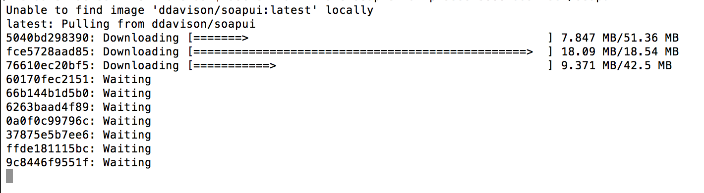
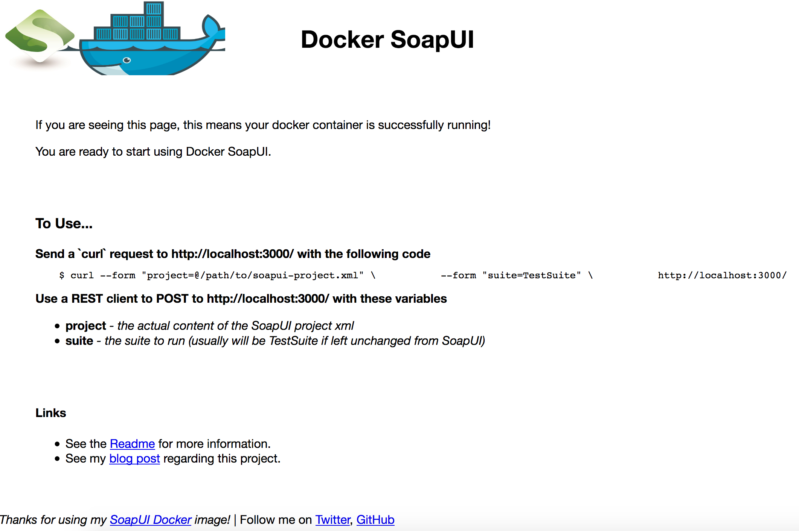

So you have a SoapUI project setup and you have built out a nice a test suite, so what's next? Tests are no good if you aren't running them, and even better running them regularly. 

You may want to add SoapUI to a nightly build  or possibly even include it in your continuous integration pipeline. The challenge can be that SoapUI will have to be installed and your project file available for test execution. 

To solve that problem we can use Docker. The heavy liftings already been done thanks to a container created by [Daniel Davidson](http://ddavison.io/). In his words:

>By containerizing SoapUI and its runner, this allows you to have a portable SoapUI installation that lets you run your SoapUI projects anywhere!

Here's how to run your SoapUI tests anywhere using docker and executing a few shell commands. 

### Installing Docker

For this How to, I have [Docker for Mac](https://docs.docker.com/docker-for-mac/) installed locally on my laptop, but any system that can run a linux docker container will do. 

If you are a Windows user don't worry, Windows 10 supports running linux containers but best to check the [docs](https://docs.docker.com/docker-for-windows/install/#download-docker-for-windows)


#### Installing the Container

Run the following command and docker will reach out to the [Docker Hub]() to pull down the docker file. If you aren't familiar with Docker Hub, think of it as github for containers. 

```
docker run --name soapie -d -p 3000:3000 ddavison/soapui
```




To create the container but not automatically start it
```
docker create --name soapie -p 3000:3000 ddavison/soapui
```

To see the containers you have running
```
docker container ls
```

### Executing Tests

The container uses two simple http requests for interaction.

- Get

We can drop that url into a browser and we'll see the following landing page:



- Post 
As you can see the status pag has instructions for sending the [cUrl](https://curl.haxx.se/) request for executing tests.

At this point we basically follow those instructions and using cUrl, or your favorite client to POST the project file and test suite name. 

```
curl --form "project=@/path/to/soapui-project.xml" \           --form "suite=TestSuite" \           http://localhost:3000/  
```

### Test Results

The http status code is your first indicator for of your tests results.
 - 200 All Tests Passed
 - 550 Test Failure(s)
 - 551 No Suite
 - 552 No Project
 - 500 Exception Running Tests

Test output is also returned in the http body of the response. 

This infomation and more details can be found at this containers [Docker Hub Page](https://hub.docker.com/r/ddavison/soapui/)


### Cleaning Up
The following commands can be used to stop or remove the container once you are done using it. 

``` 
docker stop soapie

docker stop {id}
```

```
docker rm soapie

docker rm {id}
```