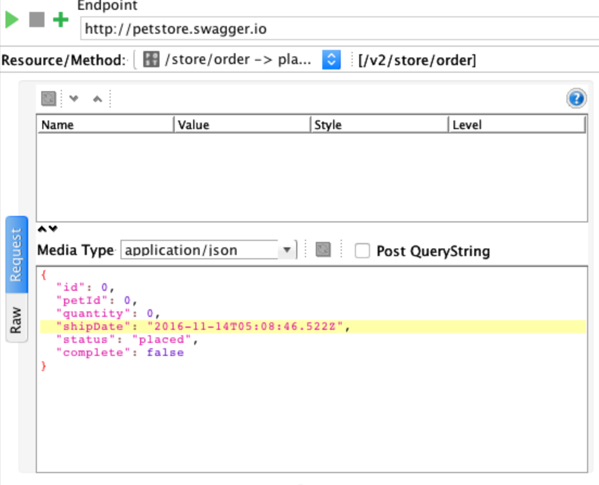
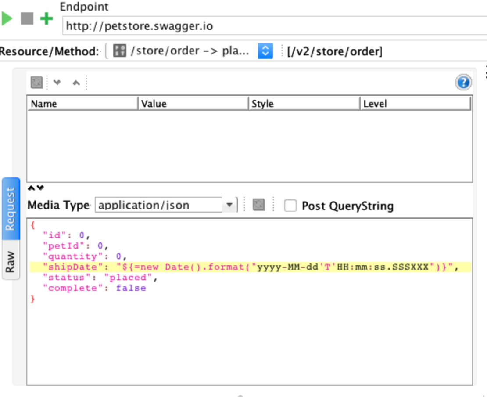
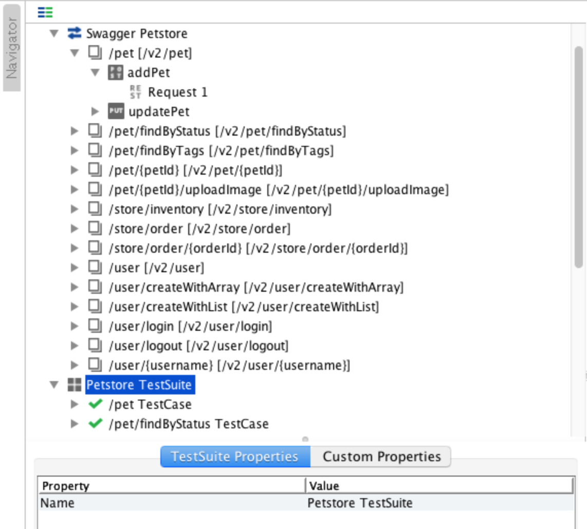
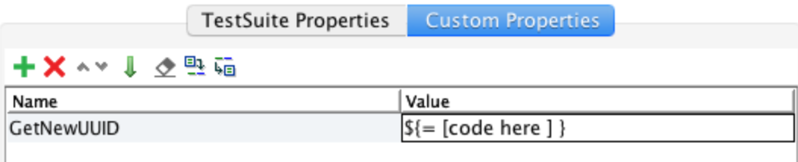
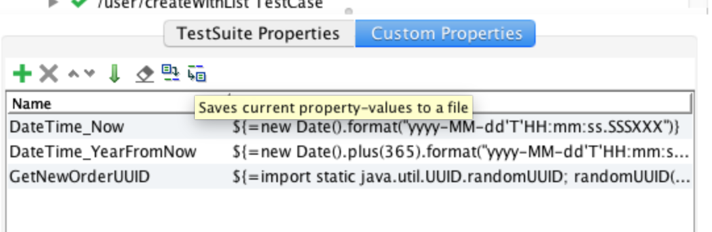
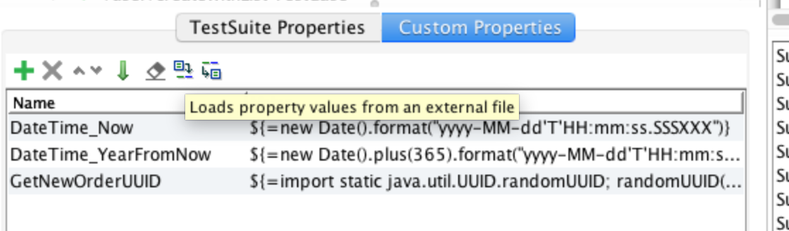
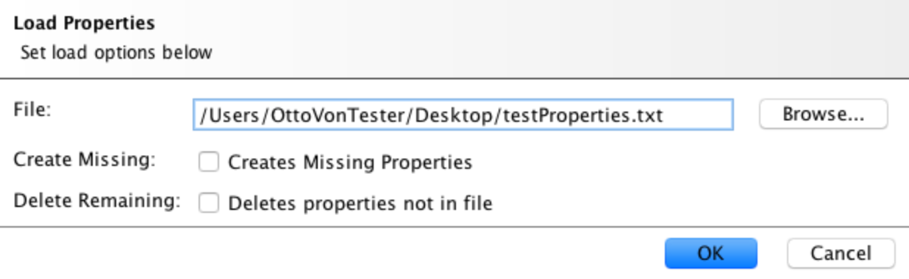

## How To... SoapUI Using Dynamic Properties 

### Why Dynamic Properties

Static test content can cause problems. An easy example of this are dates and times. Credit card expiration dates, order dates, tests with fixed date/times may run fine for months even years and suddenly start having problems as those hard coded dates take on a different context and change the tests desired behavior. 



Ok, so SoapUI lets you inject data directly into the request. 

 

In the first example can you tell the significance of that date? In the second example can you easily tell what the inline groovy snippet's code means? If you want to change the format how many places would you need to update? 

Here's how to use dynamic properties to address those concerns and end up with a set of portable, flexible and reusable properties you can use in any test. 

### How to Create A Dynamic Property

The property window is not the easiest place to write code, even if it is just short snippets. I use an online Groovy editor like [Groovy Web Console](https://groovyconsole.appspot.com/) or [JDoodle](https://www.jdoodle.com/execute-groovy-online) to get the code for the property ready first. 

Then its just a matter of adding a custom property in SoapUI, which can be done at the Project, TestSuite, or TestCase level. In this case we will add one to to our test suite.

Select your TestSuite from the Navigation tree


Click Custom Properties, then use the + icon to add a property


Then enter the name and your code snippet in the fields provided.
In order for the code to be interpreted the value field must be in the format **${=** *your code here* **}**. 


If there are multiple statements they will need to be separated by a semi-colon (**;**)
For example:
```js
 ${=import static java.util.UUID.randomUUID; randomUUID() as String }
```

### How to Use A Dynamic Property

What sets dynamic properties apart is that they help the test to be more readable and more easily maintained. It also doesn't require an additional Groovy Script test step.

You can use a dynamic property like any other property. Since we added our example to the TestSuite, inside a request call the property using the following format **${#TestSuite#*YourPropertyName*}** 
 

### How to Reuse

Now you have some properties created for your test suite, what happens when a new project comes along? Do you have to copy and paste them by hand into the next test suite? 

SoapUI allows properties to be exported and the result is a very simple text file where the format is **PropertyName=Value**. 

To Export, navigate to the custom properties tab of the TestSuite and click the last icon on the right. Then choose your file name and location and click save.
 

```
DateTime_Now=${=new Date().format("yyyy-MM-dd'T'HH:mm:ss.SSSXXX")}
DateTime_YearFromNow=${=new Date().plus(365).format("yyyy-MM-dd'T'HH:mm:ss.SSSXXX")}
GetNewOrderUUID=${=import static java.util.UUID.randomUUID; randomUUID() as String }
```
You can also turn around and import values using the same format. This means you could write up your own dynamic properties outside of SoapUI and then import them in. 

To import navigate to the custom properties tab of the TestSuite and click the second to last icon on the right. Then browse to your properties file.
 

Once your file is selected you will be presented with a few options for how to load your properties. 
 

Then just click ok and your properties will be ready for use. 


