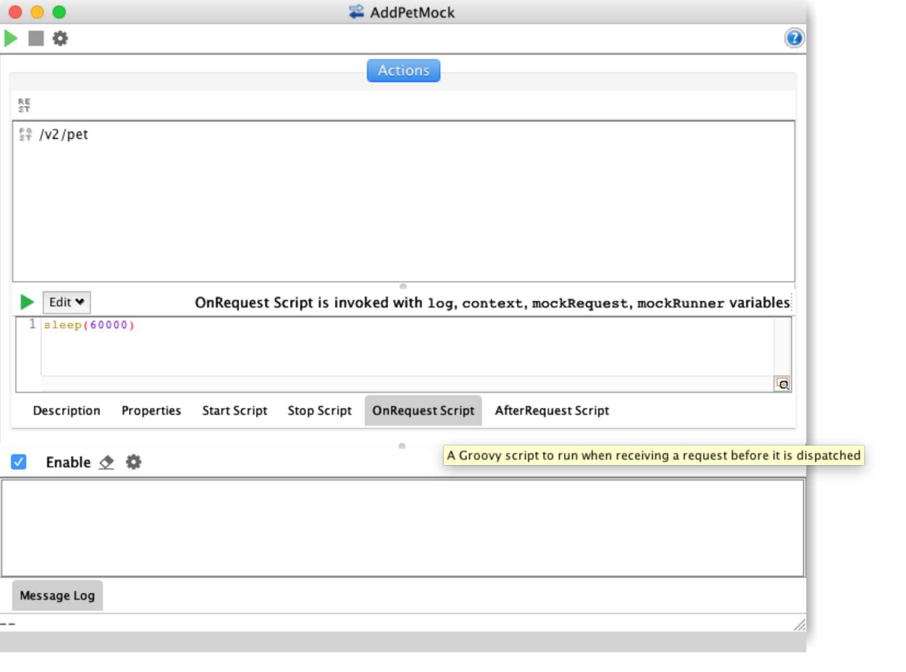

A common concern when testing applications is how the client handles slow responses or timeout scenarios. Often times the challenge comes in finding a way to generate those conditions reliably for those test cases. While SoapUI may not be your first thought since it is an API testing tool, the ability to host [Mock Services](https://www.soapui.org/soap-mocking/service-mocking-overview.html) is built in for both SOAP and REST services. Lets take a look at how we can set up a basic mock service to test timeout conditions for our client applications.

If you don't already have a SOAPUI project you will need to create one. 

## Create a Project

## Adding a Mock Service

SoapUI is a flexible tool and as usual there are multiple ways of accomplishing the same thing. It also allows you to mock a single request at a time or can autogenerate single mock service for all of your endpoints. Since the goal here is to introduce a delayed response to our application we will want to create separate mock services. This allows us to insert a delay for a specific service call without having to provide mock responses for all the services operations. 

### Mock Specific Services

The steps are a subtly different when mocking SOAP and REST services.

### SOAP 
Right Click on the Operation or Request node you want to mock. 

Enter the name of the new mock service, then click Ok.

Click Yes on the Open MockResponse Editor Dialog.

The Response Editor lets you define the response data that will be returned by the service.  

### REST 

Right Click on the Request node you want to mock. 

Enter the name of the new mock service, then click Ok.

The mock service editor window will open. 

**Note:** Rest Mock Services will be started automatically.

Close the MockService Editor and follow the prompts to stop the service.

Open the MockResponse Editor Dialog.

The Response Editor lets you define the response data that will be returned by the service.  

## Adding a Response Delay

Just like with setting up the mock services, adding a response delay is handled differently with SOAP and REST services.

### SOAP

For Soap Services adding a response delay is as easy as editing a property.
Edit the response delay to your desired amount in milliseconds.

### REST 

For REST services its a little more complex, we'll need to use the Groovy sleep command.

Open the Mock Service Editor

Click on the On Request Script and enter the delay you want in milliseconds using the following command *sleep([yourTimeoutHere])*  

## Start up your Mock Service

Open the Mock Service Editor by double clicking on your mock service in the navigation tree.
Click on the green triangle icon to start your service. 

