Despite the name, SoapUI can be used for testing Restful as well as SOAP based apis. There are many differences between SOAP and REST but the biggest when it comes to SoapUI is that SOAP apis provide a [WSDL](https://en.wikipedia.org/wiki/Web_Services_Description_Language). The wsdl defines the contract for the client application, so SoapUI takes that and generates the navigation tree with all possible requests and even populates template xml for them so you can quickly start testing.

The REST equivalent to WSDL is [WADL](https://en.wikipedia.org/wiki/Web_Application_Description_Language). SoapUI can take a REST services WADL just like it would take a WSDL for SOAP. The difference is not all REST api's provide a WADL. So what do you do if your api has no WADL, can you still use SoapUI?

One option you may want to consider is having you dev team take a look at adding [Swagger](http://swagger.io/getting-started/) in your service. There are other benefits but the most pertinent is SoapUI can automatically generate a WADL from the api documentation Swagger provides. 

If you don't have access to a WADL or Swagger, don't worry theres still hope. SoapUI supports manually configuring REST services and here's how...

Click the REST icon on the toolbar to start a new REST project. In the New REST Project dialog enter the URI to your service.
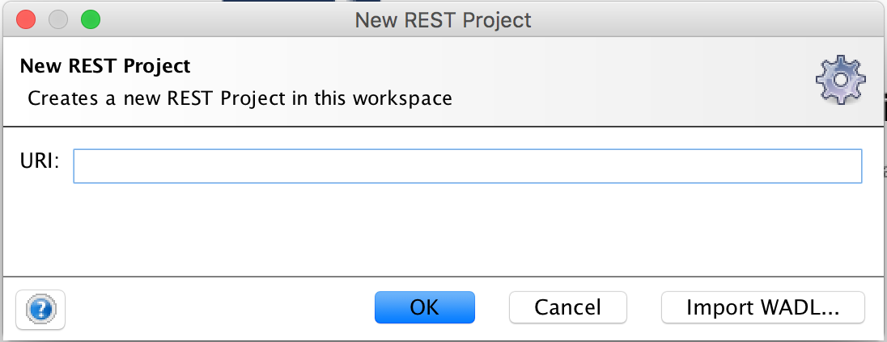

### Base Url
SoapUI will strip anything after the first slash of the URI you enter in the new project dialog. So next you'll need to go to the service properties to set the base url for the service. In this example its /v2.
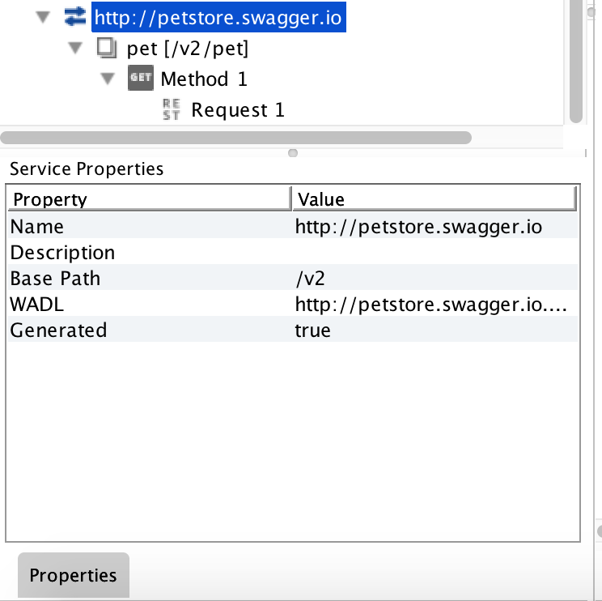

## Adding Resources
Here we start adding the various endpoints of the service.
Right click on the URI in the navigation tree and select "New Resource".
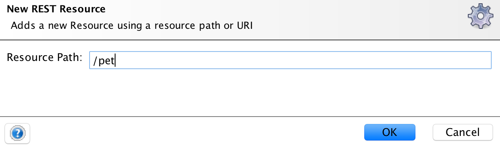

If your resource has a parameter in the the path you indicate that by wrapping the parameter name in curly braces.
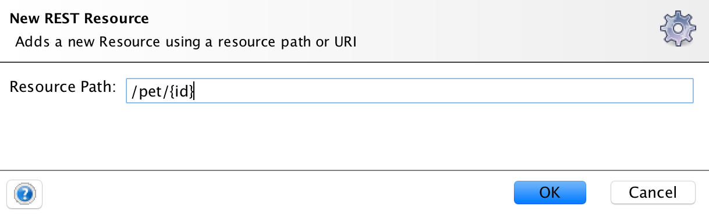

The navigation tree should look something like this:
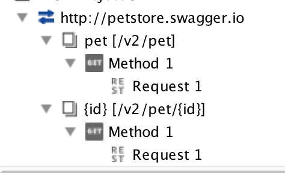

You might have noticed that the naming of the resources is only the last value after the last slash of the path. This isn't so bad for especially for the first example, but to help with clarity you may want to edit the names. 

To do this, select the resource you want to rename in the navigation tree. Then there are a few options different options for this. 

Press F2, OR right click and select "Rename" to access the "Rename Resource" dialog.

You can also edit the name in the "Resource Properties" grid on the lower left. 
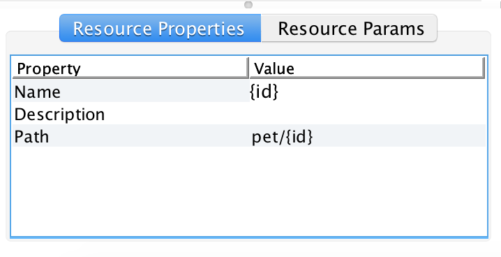

## Adding Methods
By default any resource you add will be given a Get method. Depending on the service and resource this may or may not be useful. If you do not need this method you can delete it or repurpose it. 

To add a new method, right click your resource and select "New Method".
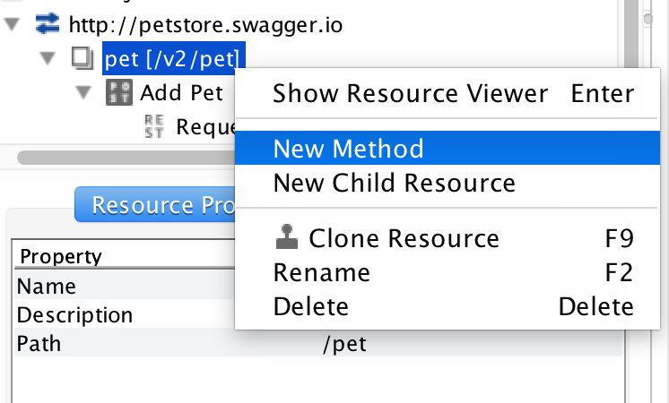

From here you can enter a friendly name and select the Http verb from the drop down. You can also add paramters here, but we will cover that later on.
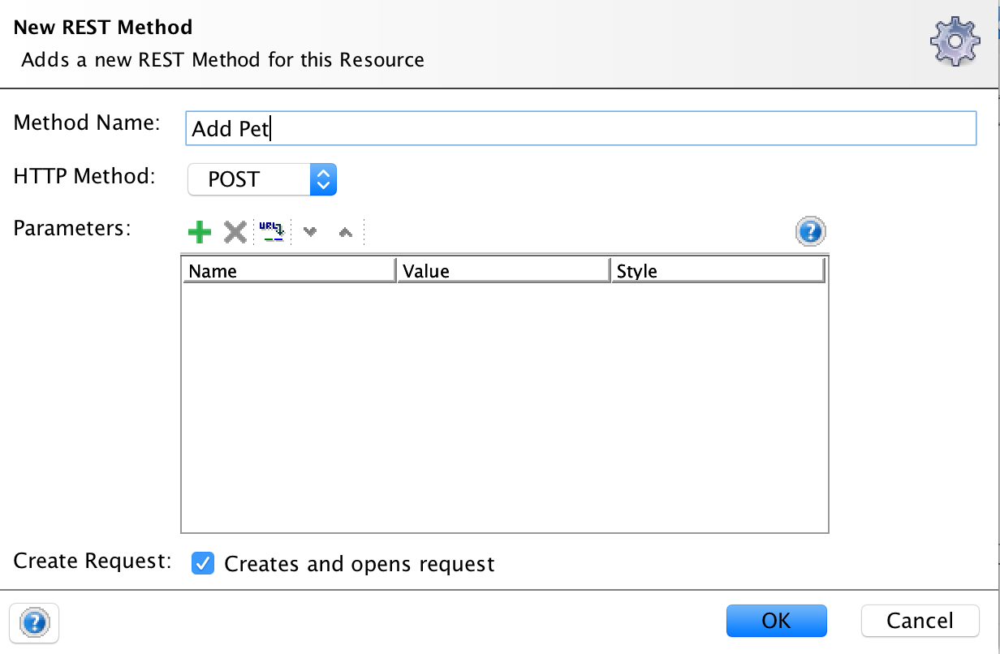

## Adding Parameters
Parameters can be added at the Resource, Method, or Request level. SoapUI uses a hierarchical approach to organizing parameters. Pratically speaking it means that parameters added at the Resource level will show up across all child requests of that resource. Method level parameters will be available for all child requests. 

The process for adding paramters at any level is basically the same. Each level in the navigation tree has a detail view/editor that you can access by double clicking,pressing enter (when node is selected), or right clicking. 

For this example we'll use the Resource level.
To add a paramter click the green plus sign. A new row will appear and allow you to enter a name, value and select the type of parameter.
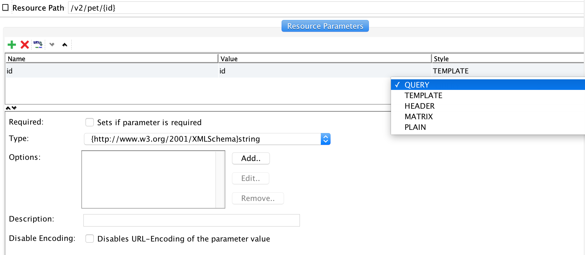

The icon next to the red X will open a dialog where you can paste in a sample URL so you can let SoapUI extract paramters from it. 

### Resource vs Request

If you are on a request node adding parameters has one additional option. 
The last option in the parameter grid is "Level" this lets yo uchoose if the paramter you are adding to this request should be shared with other methods for this resource. 
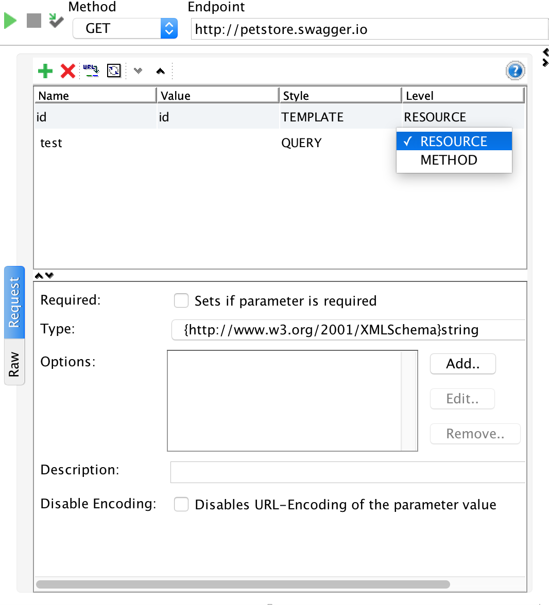

## Requests with Message Bodies
Now that your resources and methods are added you can go to the Request Editor and for the methods that need it enter sample data for the message body.
  

## Creating A Backup
This process may have been a fair amount of work depending on the size of your api. On top of saving your work in a SoapUI project, you have the option to export this data into a WADL. Right Click on the root node in the navigation tree and select "Export WADL". You never know it may prove useful for other tooling or automation.

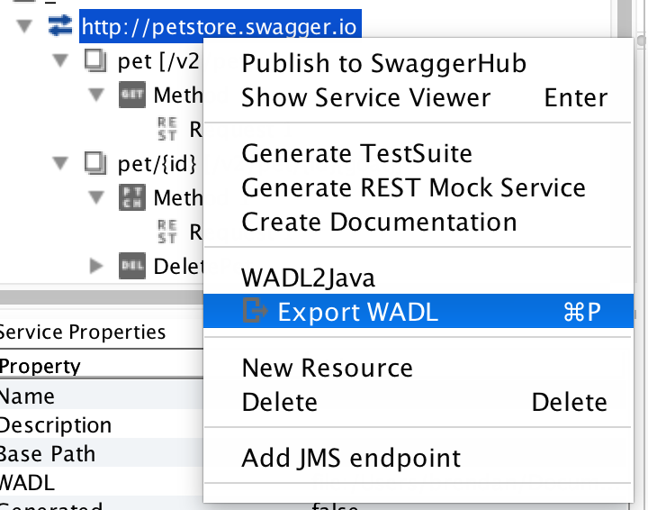

