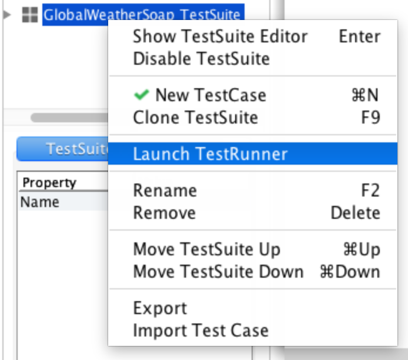
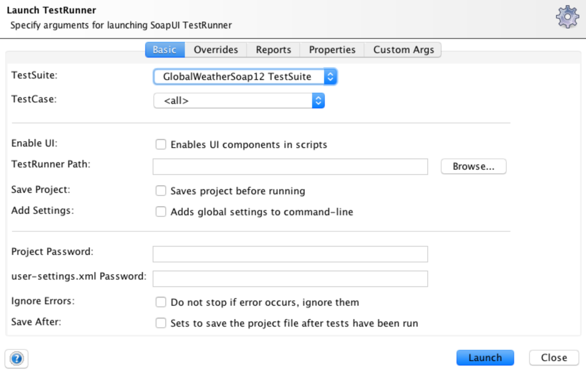
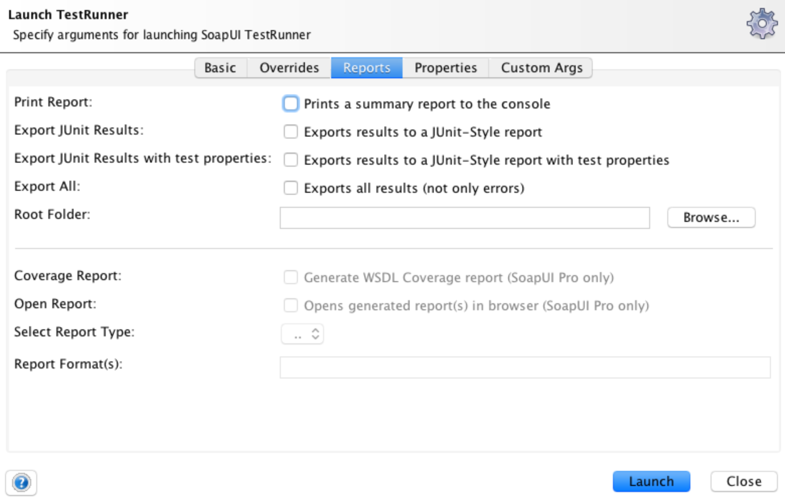
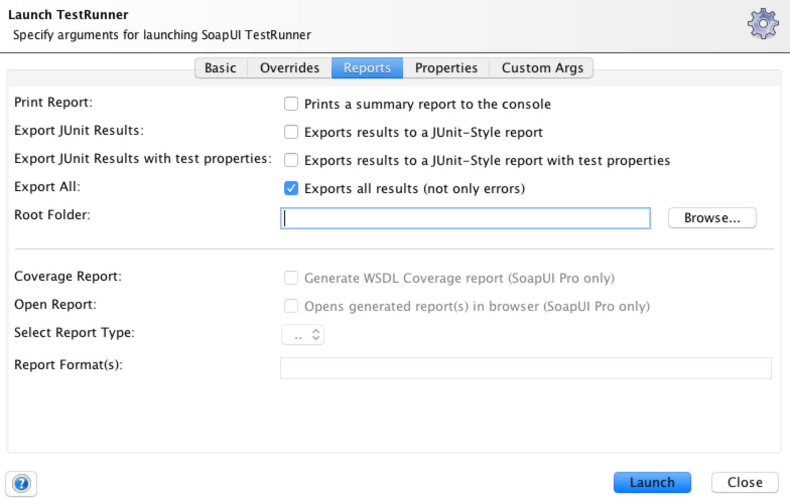
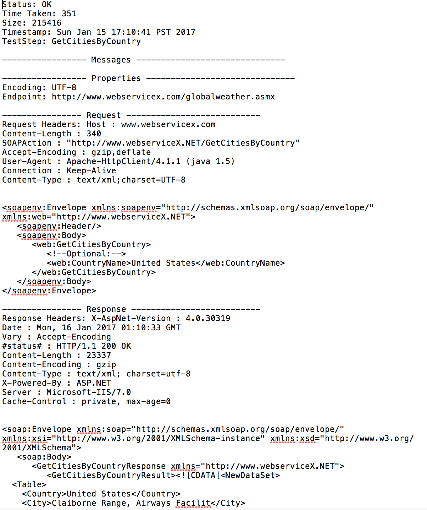

When testing interfaces via SOAP or REST it's common to want to log the request and responses being sent. It could be to help troubleshoot failed tests or to act as documentation or reference point for comparing behavior. 

There are a variety of ways to accomplish this in SoapUI depending on desired results. Most involve using some Groovy scripting, and vary whether you are using the free or paid versions.

Before you dive into Groovy, take a look at a very simple option baked into SoapUI Test Runner Reports.  After all why add more complexity to your tests if a out of the box option suits your needs.
 
To launch the Test Runner **Right click on a TestSuite or TestCase**. 

The test runner properties window will be shown. 

Click on the **Reports** tab.

Check **Exports all results (not only errors)** and enter the destination folder where you would like you logs to be written.

Click the **Launch** button to execute your tests. Wnen the tests are finished there will be a separate file for each request / response pair. The filenames will use the format *TestSuiteName_TestCaseName_RequestTestStepName_Status.txt*

**Notes:**
 If your test has multiple request and a failure occurs no further request steps will be logged. 

 You may need to close and reopen SoapUI after making changes to your tests and executing them from the test runner.

**Example Output**
