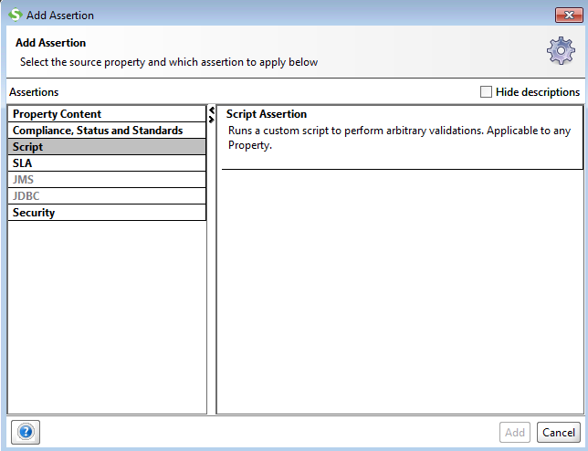
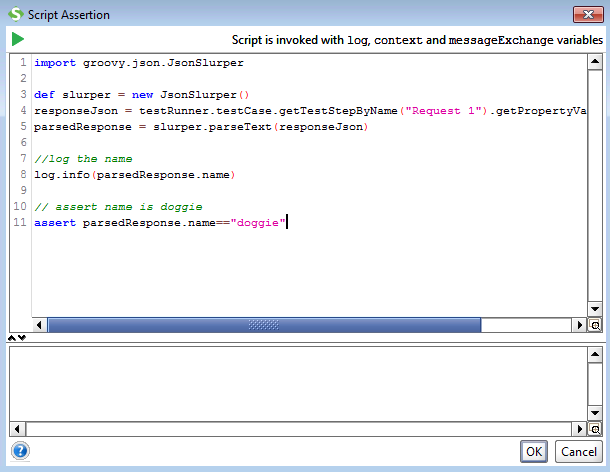

Besides communicating with an endpoint a major aspect of api testing is getting data into requests and out of responses. Out of the box SoapUI supports XPath, XQuery and JsonPath for both property transfers and assertions. There is no doubt that those are some powerful tools, but but for complex objects or if namespaces are involved they can be challenging to create, troubleshoot, or maintain. 

Groovy to the rescue. Built in to Groovy are two classes [XmlSlurper](http://docs.groovy-lang.org/latest/html/api/groovy/util/XmlSlurper.html) and [JsonSlurper](http://docs.groovy-lang.org/latest/html/gapi/groovy/json/JsonSlurper.html) that make parsing xml and json for logging, transfers and assertions clean and easy. These classes will parse the response contents and allow you to easily access (using the dot or bracket syntax) even deeply nested properties
```  Groovy
//log the category name using bracket syntax
log.info(parsedResponse["category"]["name"])

//log the category name using dot syntax
log.info(parsedResponse.category.name)
```

### Property Transfer 

The easiest way to do this is to use a Groovy Test Step in conjunction with a property to act as a placeholder for the dynamic value.

``` Groovy
import groovy.json.JsonSlurper

def slurper = new JsonSlurper()

//get the response data from a test step
responseJson = testRunner.testCase.getTestStepByName("Request 1").getPropertyValue("response")
parsedResponse = slurper.parseText(responseJson)

testRunner.testCase.setPropertyValue("petName",parsedResponse.name)
```


### Assertions
For assertions we will use a *Script Assertion*



Script Assertions are not invoked with the *testRunner* variable so we will use the *messageExchange* variable for this script



### Working With Xml

Depending on your needs XmlSluper can be aware of namespaces or ignore them. By default namespaces will be required.

``` groovy
//default namespace aware slurper
def slurper = new XmlSlurper()

//to ignore namespaces 
def nameSpaceIgnoringSlurper = new XmlSlurper(false,false)


```
