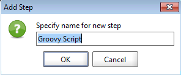

Besides communicating with an endpoint a major aspect of api testing is getting data into requests and out of responses. Out of the box SoapUI supports XPath, XQuery and JsonPath for both property transfers and assertions. There is no doubt that those are some powerful tools, but but for complex objects or if namespaces are involved they can be challenging to create, troubleshoot, or maintain. 

Groovy to the rescue. Built in to Groovy are two classes [XmlSlurper](http://docs.groovy-lang.org/latest/html/api/groovy/util/XmlSlurper.html) and [JsonSlurper](http://docs.groovy-lang.org/latest/html/gapi/groovy/json/JsonSlurper.html) that make parsing xml and json for logging, transfers and assertions clean and easy. These classes will parse the response contents and allow you to easily access (using the dot or bracket syntax) even deeply nested properties
```  Groovy
//log the category name using bracket syntax
log.info(parsedResponse["category"]["name"])

//log the category name using dot syntax
log.info(parsedResponse.category.name)
```

### Property Transfer 

The easiest way to do this is to use a Groovy Test Step in conjunction with a property to act as a placeholder for the dynamic value.

In this example I have added a property called petName to the testcase.



In the test step window 

``` Groovy
import groovy.json.JsonSlurper

def slurper = new JsonSlurper()

//get the response data from a test step
responseJson = testRunner.testCase.getTestStepByName("getPetByIdRequest").getPropertyValue("response")
parsedResponse = slurper.parseText(responseJson)
//log the value
log.info(parsedResponse.name)

//set testcase property
testRunner.testCase.setPropertyValue("petName",parsedResponse.name)
```

In case you aren't familiar with Groovy, let's unpack that script some. In the first two lines, the import statement lets our script know that we will be using the JsonSlurper and the second line creates and stores an instance of the slurper for us to use later in the script. 

SoapUI injects some variables automatically for us to use inside our scripts. To get access to the response data we will use one of those variables *testRunner* to get access to teh response data. We then pass the response data to the slurper to parse for us. 

In the last two lines we use the parsed result to log (another variable injected by SoapUI) and set the value of the property we created on the testcase.  


### Assertions
For assertions we will use a *Script Assertion*


Script Assertions are not invoked with the *testRunner* variable so we will use the *messageExchange* variable for this script. For this example you can see both Json and Xml scripts. 

``` groovy
import groovy.json.XmlSlurper

def slurper = new XmlSlurper(false,false)

//SoapUI injects the messageExchange variable 
responseJson = messageExchange.responseContent
parsedResponse = slurper.parseText(responseJson)

//log the name
log.info(parsedResponse.name)

// assert name is doggie
assert parsedResponse.name=="doggie"
```


### Working With Xml Namespaces

Depending on your needs XmlSluper can be aware of namespaces or ignore them. By default namespaces will be required.

``` groovy
//default namespace aware slurper
def slurper = new XmlSlurper()

//to ignore namespaces 
def nameSpaceIgnoringSlurper = new XmlSlurper(false,false)


```
