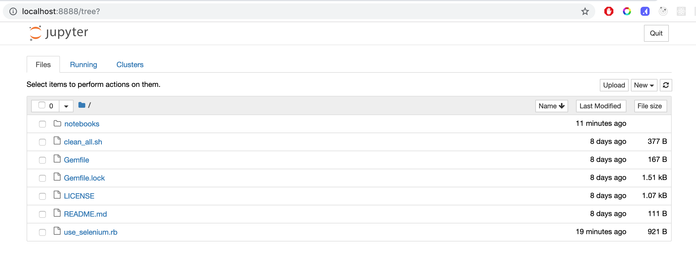
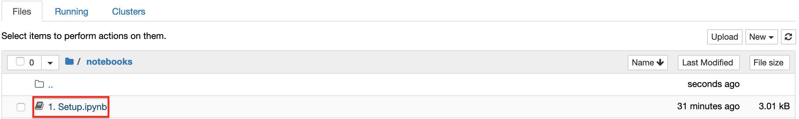
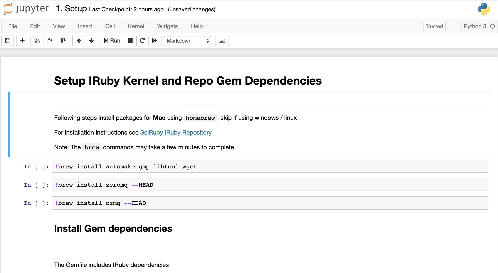
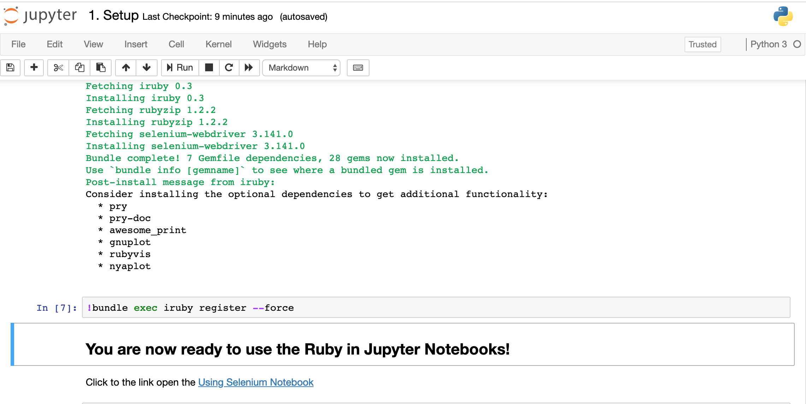
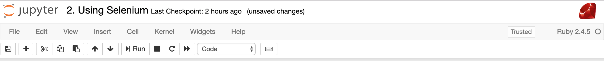
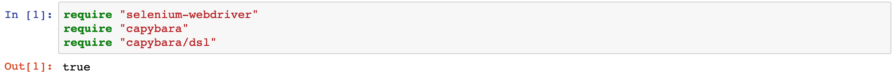
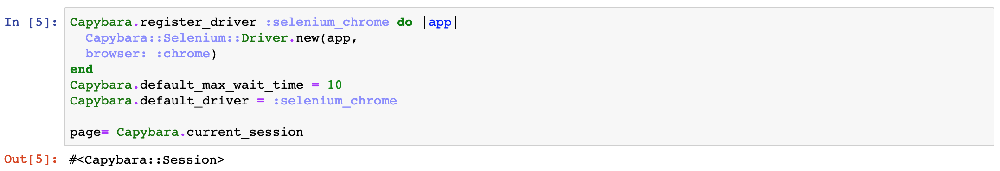
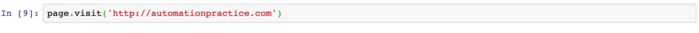
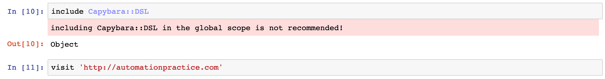
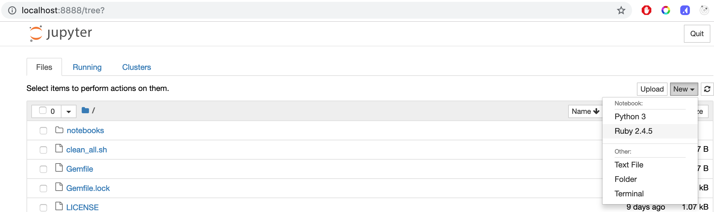

## What are Jupyter Notebooks

Jupyter Notebooks are web based documents that blend together [markdown](), code that can be executed on the fly as well as visual output of that codes results.  

They have gained immense popularity in data science and academia. The code to manipulate data can live side by side with the resulting visualization and an explanation for how it should be interpreted. What makes it even more powerful code is editable and executable in real time by the viewer, so the full story of the code can come to life right in front of their eyes.

### Multi-Language Support

Jupyter requires and runs on Python but don't let that fool you, it supports over [40 different languages](https://github.com/jupyter/jupyter/wiki/Jupyter-kernels) including JavaScript, Ruby, Java, C#.  Language support is provided through a concept called [kernels](https://jupyter.readthedocs.io/en/latest/projects/kernels.html) which enables the Jupyter user interface to hand off the code execution to language specific engines. 

Each notebook is created targeting a specific language kernel, 

## Why with Selenium?

This all sounds very interesting and all, but why use a tool for data scientists and academics for software testing?

As test automation efforts on teams grow and mature, the automation frameworks the get built tend to optimize for the headless execution of tests. It makes sense, its faster and less intrusive to run tests without having the application popup into view and take over your machine as it runs through the application under test. 

When writing a test though your needs are different and sometimes at odds with this focus on isolated, and invisible invisible testing. It's a visually intensive process to see how the actions and selectors you are using are actually working.

Test authoring requires you to step through the workflow and sometimes repeatedly try just a few lines of a test multiple times. 

Mistakes or the fun nuances in products you find when attempting to automate them mean you need different selectors, a different wait strategy, or any number of other things that result in needing to re-execute the test.

In traditional test authoring you would re-run the test, maybe with the debugger and a few break points set. This means wait for any test data setup to complete, spin up the browser and then wait for your test to get to the lines you need to work on. Even if this is fairly fast it still breaks up your feedback loop.

Using Jupyter, the cells inside a notebook can be added or edited in real time while you are automating. The feedback loop for the automation developer is lightning fast because the browser can remain open and visible while you work.   

It enables a very [TDD]()esque workflow. Write only the lines of code you need to get started. Execute that code, view the result. If there was an issue you can see it immediately and fix it. If it was successful write the minimum code for the next step of the test in the next cell. 

Then you can start to refactor the code inside the notebook. Consolidating multiple cells into a single cell representing an action or behavior. Once that actin is encapsulated it can be further refactored into a function in an external file for reuse.

## Setup

### Prerequisites 
The Jupyter team recommends installing python using [Ananconda](). Anaconda automatically includes Jupyter and many of the popular data science packages.

For this guide you will also need to have [Ruby](https://www.ruby-lang.org/en/documentation/installation/), [Chrome Webdriver](http://chromedriver.chromium.org/downloads) and [Git](https://git-scm.com/downloads) installed.

Clone the [Getting Started Repository](https://github.com/brendanconnolly/getting-started-with-selenium-and-jupyter/blob/master/notebooks/Setup%20Ruby%20Kernel.ipynb). 

Open a command window and navigate to the repository folder and execute `jupyter notebook --NotebookApp.token=''`. 
This will start the Jupyter server locally with authentication disabled and open the notebook dashboard in a browser window.

## Using Notebooks

Before we can start using ruby in notebooks, we first need to install the ruby kernel. We will use the `Setup.ipynb` notebook to install the kernel. 

All notebook files in the repository are located in the `notebooks` folder. To open a notebook click on the `notebooks` folder in the Jupyter dashboard.

Click on the `Setup` notebook file

The notebook will open.

To execute the commands in the highlighted cell click the  or press `ctrl+enter` or `shift+enter` to execute and select the next cell when the command is completed. 

While a `code` cell is executing it will show as `In [*]` and update to `In [<count>]` when it has completed. 
The result of each command will also be displayed below the cell. 

After running all commands in the notebook the [IRuby]() kernel will be installed. Click the link in the last cell to open the `Using Selenium Notebook`

## Using Selenium
Notice that the logo and language version in the upper right corner of the notebook are now Ruby!

To control the browser we will be using selenium with [Capybara](https://github.com/teamcapybara/capybara). The first step is to `require` those packages in the notebook.  

Next we wire up Capybara to use chrome webdriver so we will have a session we can use later in the notebook.

Then it's just a matter of using a `visit` command and Capybara will launch a Chrome instance and load the url. 

If you prefer to use the [Capybara DSL]() we add `include Capybara::DSL` to a cell in the notebook. This will log a warning to the cell's output but it is nothing to be concerned about. This only appears because we are using the include statement outside of a `module` or `class`. 

At this point you can use Capybara and Selenium commands just like you normally would while automating. Click the `+` icon to add a cell, and use the arrow icons to change the order of cells. 

### Variables and Output
In the examples above you may have noticed that the `page` object is created in one cell then used in subsequent cells and there is some logging of results.

In many ways a running notebook behaves the way executing commands in a `irb` console session would. 
Console output will be included in the output of a cell, as well as the result of the last statement executed inside the cell. 

Variables created in one cell, once it is executed are available for use in all other cells. This means while there is an order when creating cells, cells can be run multiple times or in a different order. 

### Clean Up
Since the browser is visible it can be tempting to close it manually. Even if you are still writing or using a notebook, just out of habit you might close the browser. This will result in error messages because Capybara and Selenium still hold a reference to the old driver instance. 

If this occurs you will need use the `refresh` button in the Jupyter ui to restart the IRuby kernel and rerun the cells.

To help manage this it can be helpful to end each notebook with a cell to clean up and exit the browser using `page.driver.quit`. 

## Composing and Refactoring
Working in Jupyter is different than in a ide, it allows active interaction with the code you are writing. It can be helpful to start by keeping the amount of code in each cell small. If there are problems make changes and rerun the cell. Then you can start to consolidate the code into a single cell that performs as desired action. 

It's not required to write code this way, but it prevents the need for writing a big chunk of code, only to realize there is an issue somewhere and start trying to debug it. Even then, when trying to figure out where the problem is it helpful to decompose the code into multiple cells. Instead of trying to insert a breakpoint or add console log statements, leverage the fact that Jupyter allows the user to control the flow of execution using cells much the way stepping through a debugger. Then once the issue is resolved the contents of the cells can be combined. 

### Refactoring

Code inside notebooks is still code and is going to need to be maintained. Once you find yourself copy and pasting the contents of cells into different notebooks it may be time to consider extracting that code into a function contained in a separate ruby file. 

A basic example of this can be seen in the `Selenium Refactored` notebook. The code to wire up Capybara with the Chrome driver has been moved into a file in the root of the repository. This model can be extended to begin building out page objects and ultimately a testing framework.

## Creating Your Own
Now you have the basics down, create a new notebook and start exploring. 
Navigate to the notebook dashboard.

Click new and select Ruby and a new notebook will be created.

